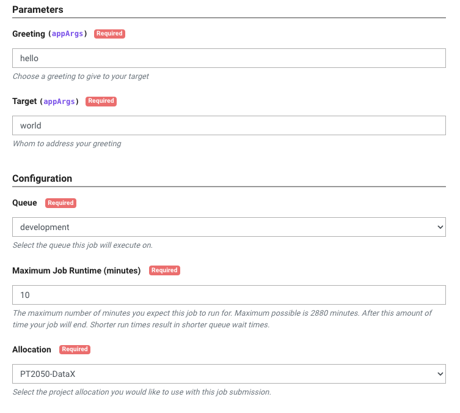
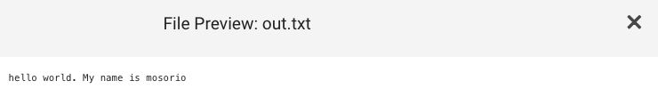
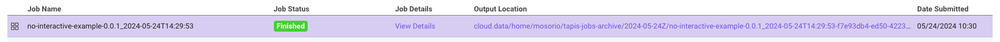
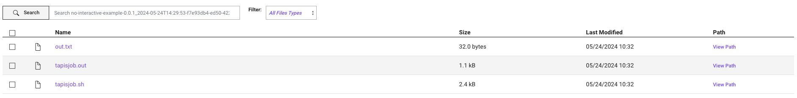

This template is the first in a [series of tutorials](#next-tutorials) that will guide you through the process of creating a cookbook and running it on TACC systems. From simple ones that run a command to more complex ones that run a Python using conda or a Jupyter Notebook.

## Requirements

- A GitHub account
- TACC account. If you don't have one, you can request one [here](https://accounts.tacc.utexas.edu/register)
- To access TACC systems, you should have an [allocation](https://tacc.utexas.edu/use-tacc/allocations/)
  - You can see your allocations [here](https://ptdatax.tacc.utexas.edu/workbench/allocations/approved)
  - If you don't have an allocation, you can request one [here](https://portal.tacc.utexas.edu/allocation-request)

## Template Overview

This template creates a simple cookbook that will run a job on a TACC cluster using two parameters/arguments, Greeting and Target, and obtain the output via a UI, saving it to a file named out.txt.





### How does it work?

1. [`app.json`](app.json) file: contains the definition of the Tapis application, including the application's name, description, Docker image, input files, and advanced options.
2. [`Dockerfile`](Dockerfile): a Docker image is built from the [`Dockerfile`](./Dockerfile). The Docker image defines the runtime environment for the application and the files that will be used by the application.
3. [`run.sh`](run.sh): contains all the commands that will be executed on the TACC cluster.

### Job run script

The `run.sh` file is used to run the commands.

```bash
#!/bin/bash

Greeting=$1
Target=$2

FULL_GREETING="${Greeting} ${Target}. My name is ${_tapisJobOwner}"
echo "$FULL_GREETING"

echo $FULL_GREETING > $_tapisExecSystemOutputDir/out.txt
```

The `run.sh` script receives two parameters, `Greeting` and `Target`, and uses them to create a message that will be saved to a file named `out.txt`.

Also, the script uses the `_tapisExecSystemOutputDir` variable, which contains the path where the application writes the output files.

## Create your Cookbook

### Create a new repository

1. Click on the "Use this template" button to create a new repository
2. Fill in the form with the information for your new repository

### Build the Docker image

You can skip this step if you don't want to build the Docker image yourself. You can use the Docker image from the [Docker Hub](https://hub.docker.com/r/taccaci/cookbook-python).

1. Clone the repository
2. Build the Docker image using the command below

```bash
docker build -t cookbook-python .
```

3. Push the Docker image to a container registry

```bash
docker tag cookbook-python <your-registry>/cookbook-python
docker push <your-registry>/cookbook-python
```

### Modify the `app.json` file

Each app has a unique `id` and `description`. So, you should change these fields to match your app's name and description.

1. Download the `app.json` file
2. Change the values `id` and `description` fields with the name and description as you wish.
3. If you built the Docker image, change the `containerImage` field with the image name you used.

### Create a New Application on the Cookbook UI

1. Go to [Cookbook UI](https://in-for-disaster-analytics.github.io/cookbooks-ui/#/apps)
2. Click on the "Create Application" button
3. Fill in the form with the information from your `app.json` file
4. Click "Create Application"
5. A new application will be created, and you will be redirected to the application's page

### Run your Cookbook

1. Go to the application's page on the Cookbook UI, if you are not already there
2. Click on the "Run" button on the right side of the page. This will open the Portal UI
3. Select the parameters for your job
   

### Check the Output

1. After the job finishes, you can check the output by clicking on the "Output location" link on the job's page
   
2. You will be redirected to the output location, where you can see the output files generated by the job
   
3. Click on a file to see its content. In this case, the file is named `out.txt`
   

## Next templates

- [Running a command](https://github.com/In-For-Disaster-Analytics/Cookbook-Docker-Template)
- [Running a Python script using conda](https://github.com/In-For-Disaster-Analytics/Cookbook-Conda-Template)
- [Running a Jupyter Notebook](https://github.com/In-For-Disaster-Analytics/Cookbook-Jupyter-Template)

## Authors

William Mobley - wmobley@tacc.utexas.edu
Maximiliano Osorio
